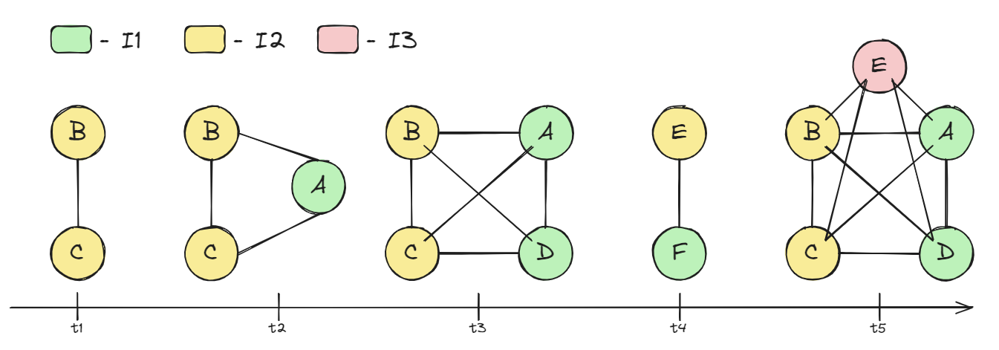

# Analytics Plan

This document outlines the analytics plan for the collaboration recommender system. We first define the terms used in
the context of collaboration analysis, followed by a plan of exploratory data analysis and collaboration
characteristics. The idea is that these insights will power an interactive analytics dashboard that will help us
understand the collaboration dynamics between EUTOPIA institutions.

## :information_source: Defining Collaboration

In this section we define the terms used in the context of collaboration analysis.

### :page_with_curl: Publication Types

- **Sole Author Publication:** An article is considered a sole author publication if it has only one author.
- **Internal Collaboration:** An article is considered an internal collaboration if all authors are from the same
  institution.
- **External Collaboration:** At a given point in time **t**, we define an **external collaboration** as a group of
  authors from
  at least two different institutions publishing an article together.
- **EUTOPIA Collaboration:** we define a publication a **EUTOPIA collaboration**, when authors from two or more EUTOPIA
  institutions collaborate.

### :new: New Collaboration

**New Collaboration:** we define a **new collaboration** as a unique set of authors that have not yet collaborated. That
is, a new collaboration is considered when an author collaborates with another author for the first time.

### :boom: Collaboration Impact

Since not all collaborations are equally important, we define **Novelty Collaboration Impact** that captures the
importance of a new collaboration taking into account the following factors:

- it is more important if there is more new authors added,
- it is more important if a new author is from a new institution,
- it is more important if a new author is added to a small collaboration rather than a large one,
- if authors and institutions have already collaborated, then it is more important if there wasn't a lot of
  collaboration between them.

Let's first define some **base terms**:

- **A_i**: Set of authors involved in the collaboration at time t1.
- **I_i**: Set of institutions corresponding to authors A_i.
- **A_prev**: Set of authors who have previously collaborated.
- **I_prev**: Set of institutions involved in previous collaborations.
- **C_aa**: Number of prior collaborations between author pairs (a1, a2).
- **C_ii**: Number of prior collaborations between institution pairs (i1, i2).
- **S_old**: Size of the old collaboration (number of old authors).-

Then we can define the **Novelty Collaboration Impact (NCI)** as follows:

1. New authors impact: **N_aa** = Sum of (1 / (1 + number of prior collaborations between each pair of authors in A_i))
2. New institutions impact: **N_ii** = Sum of (1 / (1 + number of prior collaborations between each pair of institutions
   in I_i))
3. Collaboration size adjustment: **S_a** = 1 / sqrt(S_old + 1)
4. **NCI = N_aa * (1 + N_ii) * S_a**

**For example:** say we have authors A, B, C, D, E and F. Authors A, D and F are from institutions I1 and authors B, C
and E
are from institution I2.

- **t1:** Then if authors B and C publish an article together, it is important because it is a collaboration of a new
  pair of authors, but it is not a new collaboration on institution level.
- **t2:** However, if author A from a new institution joins authors B and C for the first time, then this is a new
  collaboration on an institutional level and it as such it is more important even though it has less new authors.
- **t3:** If at a later point in time, author D joins forces with authors B, C and A , it is less important because
  it is a collaboration of authors that have already collaborated and only a new author from an already included
  institution is added. A real life example of this would be a PhD student joining the group of his/her supervisor.
- **t4:** At a later point, author E starts collaborating with author F, this is a new collaboration of great importance
  because an entirely new collaboration is formed between two institutions, even though the institutions have already
  collaborated.
- **t5:** Finally, if author E joins the group of authors B, C, A and D, it is more important because we create a new
  institutional collaboration, even though the majority of authors have already collaborated.

This case returns the following NCI values:

| Collaboration | NCI  |
|---------------|:----:|
| t1            | 1.00 |
| t2            | 1.67 |
| t3            | 1.63 |
| t4            | 1.33 |
| t5            | 4.17 |

## :detective: Exporatory Data Analysis

First of all, we need to have a good understanding of the data we have including data coverage, quality and some basic
statistics.

### :bar_chart: Basic Statistics

Regarding understanding the basic statistics of article collaboration we need to be able to answer questions:

- How many articles do we have?
- How many authors do we have?
- How is the number of articles and authors trending over time?
- How many articles and authors are from EUTOPIA institutions?
- How many articles were made in collaboration internally vs. between different institutions, and how many with only one
  author?
- How many articles were made in collaboration between EUTOPIA institutions?
- How many new collaboration events do we have?
- Which authors tends to be more collaborative with EUTOPIA institutions?

### :shield: Data Coverage

Going forward, we need to understand data coverage on most important fields:

- How many articles has titles, abstract, references?
- How many authors has affiliation information?
- How many authors has ORCID ID?
- How many articles are written in English vs. other languages?
- How many articles are open access, and we can access the full text via Unpaywall?

## :people_holding_hands: Collaboration Characteristics

After understanding the basic statistics of the data, we want to dive deeper into collaboration characteristics.
Primarily, we want to understand two things:

1. **Occurrence of new collaborations:** When and why does a new collaboration occur?
2. **Influence of new collaborations:** How does a new collaboration affect all parties involved?

### :new: Occurrence of New Collaborations

**Questions:**

1. Does the initiation of a new collaboration stem from expertise, meaning, is it driven by one institution possessing
   significant proficiency in a particular area and thus being sought after for their complementary skills?
2. How does affiliation change over time? Can we detect people moving to different institutions vs. collaborating?
3. Can we connect a new collaboration event to a topic trend peak?
4. Are collaborations more likely to be initiated by early-career researchers or established academics?

**Hypotheses:**

1. Collaboration is often motivated by expertise.
2. Collaboration can be a result of a topic trend peak and the surrounding hype.
3. New collaborations are more likely to be initiated by established academics with a large network of collaborators and
   resources.

### :chart_with_upwards_trend: Influence of New Collaborations

**Questions:**

1. How does the trend of collaborations increase after the first collaboration?
2. How does a new collaboration affect the overall research direction of all involved institutions/working groups?
3. How does success of a new collaboration affect the likelihood of future collaborations?

**Hypotheses:**

1. Collaboration trend increases exponentially after the first collaboration.
2. Collaboration significantly affects the research direction of all involved institutions/departments.
3. If a new collaboration is successful, the likelihood of future collaborations increases.

## :computer: Analytics Dashboard

In this section, we outline a rough structure for the analytics dashboard with which we will be able to interactively
explore the collaboration dynamics between EUTOPIA institutions and authors.

1. **Overview dashboard page:** shows some basic statistics like the number of articles, authors, trends, EUTOPIA
   collaboration statistics, and new collaboration statistics.
    - This page will include all the KPIs that will show the current state of the collaboration dynamics and our data.
2. **Collaboration characteristics page:** shows the occurrence and influence of new collaborations.
3. **Institution collaboration page:** shows the collaboration characteristics but from the perspective of a single
   institution.
4. **Author collaboration page:** shows the collaboration characteristics but from the perspective of a single author.