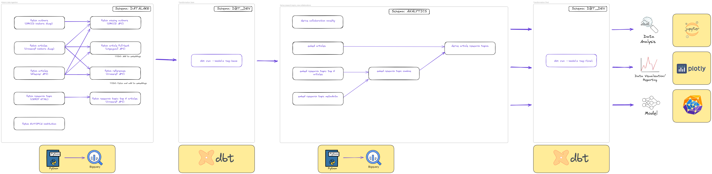

# Historic Data Ingestion

- All data is ingested into a BigQuery dataset: `DATALAKE`.
- All the necessary credential instructions for the APIs can be found in the respective API
  documentation: [Credentials](../credentials/Credentials.md).

<hr/>

## Data Ingestion Lineage

The following diagram shows the entire data preparation lineage, where this document only focuses on the highlighted
part:

1. **(Covered in this document)** Historic data ingestion
2. Transformation: base
3. Generate embeddings
4. Transformation: final


<hr/>

## CERIF Registry

### fetch research topic (CERIF HTML)

**Data table:** `DATALAKE.CERIF_RESEARCH_TOPIC`.

**Definition**: CERIF Registry is a registry available
at [aris](https://www.arrs.si/en/gradivo/sifranti/sif-cerif-cercs.asp) website, where we see the Common European
Research Information Format (CERIF) standard. It is used as a registry of research topics to which we will map articles
and authors.

To ingest the data from the CERIF registry, we will first download the HTML from the website to `data/cerif.html` and
then run:

```bash
python CERIF_research_topic.py
```

<hr/>

## Crossref API

**Description**: Crossref API is a RESTful API that allows us to access metadata for scholarly articles. It serves as
the base for our
dataset, as it gives us data about articles, authors and their affiliations and partly about article content.

### fetch articles (Crossref historic dump)

**Data table:** `DATALAKE.CROSSREF_HISTORIC_ARTICLE`.

The Crossref organization also provides a metadata dump of their database, which is updated yearly. This dump is
available
at: [Crossref Public Data File](https://www.crossref.org/blog/2024-public-data-file-now-available-featuring-new-experimental-formats/)
and can be downloaded via [Academic Torrents](https://academictorrents.com/).

After downloading the data to the `data` folder, we can process it by running:

```bash
python Crossref_articles.py
```

### fetch references (Crossref API)

**Data table:** `DATALAKE.CROSSREF_API_REFERENCE_ARTICLE`.

**Depends on:** `DATALAKE.CROSSREF_HISTORIC_ARTICLE`.

The Crossref API allows us to fetch references for a given article. We will use this to enrich the Crossref articles
with
references.

```bash
python Crossref_article_references.py
```

### fetch research topic: top N articles (Crossref API)

**Data table:** `DATALAKE.CERIF_RESEARCH_TOPIC_TOP_N_ARTICLES`.

**Depends on:** `DATALAKE.CERIF_RESEARCH_TOPIC`.

The Crossref API allows us to fetch the top N articles for a given research topic. We will use this to enrich the CERIF
research topics with the top N articles for each topic.

```bash
python Crossref_research_topic_top_n_articles.py
```

### Process Crossref historic data

Here we give a brief description of the processing steps for the Crossref historic data. Since the dataset is quite
large, we do not use dbt for transformation, but rather define a stored procedure that breaks down the source data in
smaller chunks by year and month. This procedure is then called in a loop to process the entire dataset.

Calling a single step of processing Crossref historic data:

```sql
CALL DATALAKE.SP_FILL_CROSSREF_HISTORIC_ARTICLE_PROCESSED(year, month);
```

Calling the loop to process the entire dataset:

```sql
CALL DATALAKE.SP_ITERATE_FILL_CROSSREF_HISTORIC_ARTICLE_PROCESSED();
```

### Incremental Updates

For additional data and updates, we will
use [Crossref REST](https://www.crossref.org/documentation/retrieve-metadata/rest-api/tips-for-using-the-crossref-rest-api/).

<hr/>

## ORCID API

**Definition**: ORCID API is a RESTful API that allows us to access metadata for authors and their affiliations. It is
used to enrich
the Crossref dataset with additional information about author affiliations.

### fetch authors (ORCID historic dump)

**Data table:** `DATALAKE.ORCID_HISTORIC_AUTHOR`.

The ORCID organization also provides a metadata dump of their database, which is updated yearly. This dump is available
at: [ORCID Annual Report summaries](https://info.orcid.org/annual-reports/).

After downloading the data to the `data` folder, we can process it by running:

```bash
python ORCID_author.py
```

### fetch missing authors (ORCID API)

**Data table:** `DATALAKE.ORCID_API_AUTHOR`.

**Depends on:**

- `DATALAKE.CROSSREF_HISTORIC_ARTICLE_PROCESSED`,
- `DATALAKE.ORCID_HISTORIC_AUTHOR`.

Crossref data already contains ORCID IDs for several authors, but we will use
the [ORCID REST API](https://info.orcid.org/documentation/features/public-api/) to further enrich dataset
with authors that were not present in the historic dump.

The historic API data ingestion is done by running:

```bash
python ORCID_missing_authors.py
```

### Incremental Updates

For incremental updates, we will use
[ORCID REST API](https://info.orcid.org/documentation/features/public-api/).

<hr/>

## Unpaywall API

**Definition**: Unpaywall API is a RESTful API that allows us to access metadata for scholarly articles. Specifically,
it provides us
links to downloadable full-text PDFs of articles. It is used to enrich the Crossref dataset with additional information
about article content.

### fetch article full-text (Unpaywall API)

**Data table:** `DATALAKE.UNPAYWALL_API_ARTICLE`.

**Depends on:** `DATALAKE.CROSSREF_HISTORIC_ARTICLE_PROCESSED`.

Crossref data already contains all the article DOIs but not their full-text PDF links and we will use
the [Unpaywall REST API](https://unpaywall.org/products/api) to further enrich dataset
with these links.

The historic API data ingestion is done by running:

```bash
python Unpaywall_article_full_text.py
```

<hr/>

## Elsevier API

**TODO**

